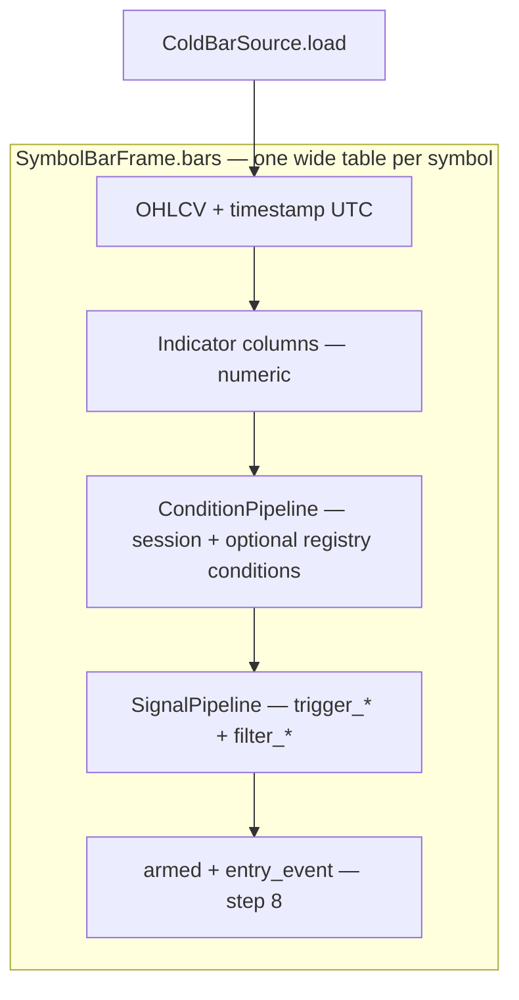

# Indicator pipeline & portfolio backtest plan

## How the backtest works (bar table mental model)

Each symbol is one **wide table**: `SymbolBarFrame.bars` — one row per minute, many columns. The portfolio engine does not hide layers; it **adds columns** in a fixed order. UTC `timestamp` and OHLCV stay canonical; everything else is derived.

### Layer roles (what each column type means)

| Layer | Package | Column type | Time shape | Role on the table |
|-------|---------|-------------|------------|-------------------|
| **Indicators** | `backtesting/indicators/` | Numeric (`ema9`, `rvol`, `vwap`, …) | Every bar | Facts — inputs to conditions and signals |
| **Conditions** | `backtesting/conditions/` | Boolean + `session` label (`signal_eligible`, `close_above_vwap`, …) | **Many bars** — sustained state | “Is this condition true **right now**?” |
| **Signals** | `backtesting/signals/` | Boolean (`trigger_*`, `filter_*`, …) | **Point in time** for triggers; filters sampled at decision bar | Strategy YAML rules on existing columns |
| **Entry logic** (step 8) | `backtesting/signals/` (arming) | Boolean (`armed`, `entry_event`, …) | Combines layers | When a row becomes a portfolio event |
| **Simulation** (step 9) | `backtesting/portfolio/` | Trades / equity (not on bar table) | Event stream | Capital, fills, exits |

**Conditions vs signals (intentional separation)**

- **Conditions** — **sustained state over many bars** (one pipeline: `ConditionPipeline`):
  - **Session conditions** (always present): `session` (PM/RTH/AH) and `signal_eligible` (are we inside the allowed trading window right now). A boolean `True` across a span of bars — e.g. `signal_eligible` is `True` from 09:30–11:30 ET for `ema_cross`. Computed first inside `ConditionPipeline` when a `SessionConfig` is attached. Math lives in `backtesting/conditions/session_regime.py`.
  - **Optional pattern conditions** from `CONDITION_REGISTRY` (e.g. `close_above_vwap`): a boolean `True` across a run of bars while price stays above VWAP. Strategies opt in via `conditions:` in YAML.
- **Signals** — **the strategy's rule engine** for YAML `triggers:` and `filters:`. `SignalPipeline` reads columns already on the table (indicators or conditions); it does not register reusable condition packs. Two sub-types:
  - *Triggers* (`trigger_*`): point-in-time edges — `True` on exactly one bar (e.g. EMA9 crossing above EMA21). Produced from YAML `triggers:`.
  - *Filters* (`filter_*`): level checks sampled at the action bar — `rvol >= 1.5`, or `close_above_vwap == true` (reading a condition column). Produce `all_filters_ok`. **Why not fold signals into conditions?** Every strategy would need registry entries for `ema9 cross_above ema21`; YAML + generic evaluators avoid that.

Both appear as **normal columns on the same table**. Neither is “off-table.” The difference is **how the column is produced** — conditions describe sustained state (many bars true), signals describe events (one bar for triggers, level check at action bar for filters).

**Strategy composition (entry, exit, add, trim)**

Actions can be driven by **either** layer, composed in YAML:

- **Triggers** (signals) — arm or fire on an **edge** (cross, break, or condition column just turned true if modeled as edge).
- **Filters** (signals) — gate on **level** at the action bar: `rvol >= 1.5`, or `close_above_vwap == true` (reading a **condition** column).
- **Conditions** — materialize sustained-state columns first; **signal filters** reference them by column name without reimplementing VWAP (or other) logic in YAML.

**Entry logic (arming)** — combines conditions and signals into a portfolio event:

1. Condition `close_above_vwap` is `True` for a run of bars (sustained state).
2. Signal trigger `ema9_cross_above_ema21` fires on **one** bar (edge event).
3. Strategy arms for `arming_window` bars after the trigger.
4. Signal filter `rvol >= 1.5` is checked on the **entry bar** (level check) → `all_filters_ok`.
5. `signal_eligible` is `True` (session condition column).
6. Step 8 combines these into `entry_event` (first per `trading_date`).

Exit / add / trim (future) use the same table: exit triggers or filters can point at condition columns or indicator columns the same way.

### Pipeline order (per symbol in the universe)

### What you see on a few rows (`ema_cross` today)

`ema_cross` uses **signals** only (no `conditions:`). Illustrative columns:

| timestamp (UTC) | ema9 | ema21 | rvol | signal_eligible | trigger_ema9_cross_above_ema21 | filter_rvol | all_filters_ok |
|-----------------|------|-------|------|-----------------|--------------------------------|-------------|----------------|
| 09:30 ET | 9.0 | 9.2 | 1.2 | True | False | False | False |
| 09:35 ET | 9.3 | 9.1 | 1.6 | True | **True** | **True** | **True** |
| 09:36 ET | 9.4 | 9.2 | 1.4 | True | False | False | False |

- **Signal trigger** — `True` only on 09:35 (point event).
- **Signal filter** — `True` on 09:35 where `rvol >= 1.5`; not an edge column.
- **Condition** — (none for `ema_cross`); if `close_above_vwap` were enabled, it might be `True` from 09:20 through 11:00 (many bars).

With VWAP conditions enabled, the same table might also include:

| … | close_above_vwap | trigger_vwap_cross_up | filter_need_vwap |
|---|------------------|----------------------|------------------|
| … | True (many bars) | True (one bar) | True when filter applied |

Here `close_above_vwap` is a **condition** (sustained state); `trigger_vwap_cross_up` is a **condition** edge registered as `ConditionKind.TRIGGER`; a **signal** filter can require `close_above_vwap == true` on the entry bar.

### Code mapping (today)

| Mental model | Implemented as |
|--------------|----------------|
| Regime / multi-bar | `ConditionKind.FILTER` outputs; YAML `filters:` on indicator or condition columns |
| Point-in-time event | YAML `triggers:` → `trigger_<id>` via `SignalPipeline`; condition `ConditionKind.TRIGGER` edges (e.g. VWAP cross) |
| Session gate | `signal_eligible` via `ConditionPipeline(session_config=...)` |
| Universe | `load_universe_bars` → `UniverseBarFrames` after full prep chain |

Registry note: `CONDITION_REGISTRY` today includes both FILTER (level) and TRIGGER (edge) kinds. New conditions should favor **sustained state**; one-bar edges can stay in conditions when reused (VWAP cross) or move to strategy `triggers:` when generic (`cross_above` on any column).

---

## Status summary

| Step | Topic | Status |
|------|-------|--------|
| 1–4 | Catalog, math, multi-res I/O, bar interval | Done |
| 5 | Session columns + `signal_eligible` | Done |
| 6 | Universe load (`universe_resolver`, `universe_loader`) | Done |
| 7 | Trigger & filter evaluator | Done |
| 8 | Arming + `entry_event` | Done |
| 9 | Simulation | Partial — see below |
| 10 | `run_backtest` CLI | Done |
| 11 | `inspect_indicator_bars` polish | Done |

### Step 9 — what is built vs what is missing

**Built:**
- `PortfolioSimulator.run()` iterates all symbols in `UniverseBarFrames`
- `PortfolioSimResult` — `trades` tuple, `trade_count`, `total_pnl`
- `Trade` dataclass — `entry_price`, `exit_price`, `shares`, `pnl`, `pnl_pct`, `exit_reason`
- Exit types: `stop_loss` (pct from entry), `take_profit` (pct from entry), `end_of_session` (last RTH bar close)
- `OtherExitClosePastEma` model exists in `strategy_config.py` — pydantic parses it from YAML, but not wired in `symbol_simulator.py` (no handler for it in `_exit_on_bar_long`)
- `fixed_dollars` sizing only
- Fill at bar close (conservative)
- `format_backtest_summary` — prints trades, `total_pnl`, PnL by symbol, elapsed time

**Missing / not yet built:**
- `OtherExitClosePastEma` — model exists, sim ignores it silently; needs handler in `_exit_on_bar_long`
- Exit via YAML signal triggers/filters (dynamic exit rules, not just hardcoded price levels) — referenced at line 43 as "(future)"
- **Equity curve** — no bar-by-bar or daily portfolio value series; `PortfolioSimResult` only sums PnL
- **Shared capital pool** — no max positions, no capital allocation across simultaneous entries; each trade is sized independently
- **Portfolio-level metrics** — no Sharpe, Calmar, Sortino, max drawdown, win rate, avg win/loss; only `total_pnl`
- **Short side** — long-only MVP; `OtherExitClosePastEma.side` supports `short` in the model but no short entry path exists
- **Daily return series** — needed for Sharpe/Calmar/Sortino; not computed

### Gaps to address before production use

| Gap | Decision | Notes |
|-----|----------|-------|
| **Run artifacts** — no `run_id`, no saving `trades.parquet` / `equity.parquet` / `request.json` to disk | Build | Re-running overwrites results; no reproducibility. Designed in `cold_lake_portfolio_backtester` plan but not wired here. |
| **`RunTimezoneConfig`** | Build | `SessionConfig.timezone` handles exchange-side clock; run-level display/input timezone wrapper is unbuilt. Affects how CLI `--start`/`--end` and printed trade timestamps behave for PT users. |
| **Commission model** | Build — flat dollar per trade | Add `commission_per_trade: float` to `SizingConfig` or a new `SimConfig`; deducted from `pnl` on close. No slippage modeling. |
| **Data snapshot version** | Build | Cold lake is mutable. No fingerprint of which parquet bytes backed a run; makes result comparison unreliable after re-ingest. Hash symbol file sizes + mtimes at run start; store in artifacts. |
| **Per-trade tags** | Build | Entry attribution (triggers fired, filter values, rvol, intraday window) not carried into `Trade`; limits post-run analysis of why trades fired. |
| **Progress reporting + cancellation** | Build | Full-universe runs over 1010 symbols have no progress output or cooperative cancel. Add a `ProgressSink` protocol with a `StdoutProgressSink`; plumb a cancel token through `load_prepared_universe` and the portfolio loop so a run can be interrupted cleanly. |
| **Walk-forward / out-of-sample discipline** | Defer | No holdout window enforcement. Note the risk in docs; implement when running parameter sweeps. |
| **`StudyRunner` / parameter sweep** | Defer | Single-config runs only. Planned in `cold_lake_portfolio_backtester` plan. |
| **Benchmark comparison** | Out of scope | Not needed. |
| **Slippage model** | Out of scope | No reliable way to model; flat commission only. |

---

## Current state (implemented)

Math lives in **`strategies/indicators/`**. Backtest wiring lives in **`backtesting/indicators/`** (catalog + generic adapter + pipeline). Strategy config lives in **`backtesting/strategy/`**. Regime/optional boolean columns live in **`backtesting/conditions/`**. Strategy trigger/filter columns live in **`backtesting/signals/`** (see **How the backtest works** above).

### Catalog (`indicator_catalog.yaml`) — single source of truth

| id | `series_fn` | Needs `daily_bars` | Notes |
|----|-------------|-------------------|--------|
| `trading_date` | `trading_date_series_utc` | no | ET session date from UTC `timestamp` |
| `ema9` / `ema21` / `ema50` | `ema_series` | no | `period` in params |
| `vwap` | `vwap_series` | no | requires `trading_date` |
| `cumulative_avg_volume` | `cumulative_avg_volume_series` | **yes** (`history_bars`) | Mean **cumulative** vol at this ET minute over prior 10 session days (RVOL denominator) |
| `rvol` | `rvol_series` | **yes** (`history_bars`) | **Cum vol so far today** / `cumulative_avg_volume` (PM+RTH+AH) |
| `rvol_time` | `rvol_time_series` (`rvol_time.py`) | **yes** (`history_bars`) | **This bar's volume** / mean(SMA(vol,20) at this ET minute on prior 10 days) |
| `adr` | `adr_series` | **yes** | RTH daily range, `days: 14` |
| `atr` | `atr_series` | **yes** | Wilder ATR on RTH dailies, `period: 14` |

- **`default_pipeline_ids`** in the same YAML file lists what `IndicatorPipeline()` runs when no ids are passed (includes `rvol`, `adr`, `atr` today).
- Registry is built from the catalog via `indicator_compute.make_indicator_compute_fn` — no hand `_compute_ema9` duplicates.
- **`scripts/sync_indicator_catalog.py`** reports `*_series` drift vs catalog (review-only).

### Cold I/O (`ColdBarSource`)

- 1m: `{OHLCV_COLD_ROOT}/1m/{SYM}.parquet`
- Daily: `{OHLCV_COLD_ROOT}/1440m/{SYM}.parquet` when present; else **RTH-only** aggregate from 1m (`daily_rth.aggregate_rth_daily_from_intraday`)
- **`daily_bar_lookback_calendar_days()`** (from catalog params) drives a **longer read window** for `daily_bars` than the 1m warmup cushion — required so ADR/ATR/RVOL are not all NaN on a single session day
- Sparse `1440m` files fall back to 1m aggregation when session count &lt; `min_daily_sessions_for_indicators()`

### Strategy bootstrap (done)

- **`strategies/configs/ema_cross.yaml`** → `StrategyConfig` via `strategy_loader.py`
- **`indicator_ids_for_pipeline()`** merges `default_pipeline_ids` with columns referenced in triggers/filters that are catalog ids (e.g. adds `rvol` for the filter even if you trim defaults later)
- **`ConditionPipeline`** / `ConditionRegistry` for VWAP booleans (`close_above_vwap`, cross triggers) — **not** in the indicator catalog; run only when a strategy requests them

### Conventions (locked)

- One file per indicator concept; `foo_series` beside scalar `foo` when the backtest needs a column.
- Indicator **ids** and **output column names** match (`rvol`, `adr`, `atr` — no `_14` / `_20` suffixes; periods live in catalog `params` only).
- **Do not** duplicate `default_pipeline_ids` in `bt_config.py` — import `default_indicator_ids()` from `indicator_catalog_load`.
- **Do not** change IB / `BarSeries` scalar APIs without deliberate tests.

---

## Daily / session rules (ADR, ATR, rvol)

1. **Params** — `period` / `days` in catalog `params` (and mirrored in module `DEFAULT_*` where scalars exist). Catalog `param_kind` (`bar_periods` vs `calendar_days`) is on the model for documentation; adapter does not reinterpret units.

2. **Daily aggregates = RTH only** — PM/AH must not define the official daily OHLCV used for ADR/ATR/RVOL denominators (`daily_rth`, cold daily path).

3. **`rvol` vs `rvol_time`** — **`cumulative_avg_volume`**: mean prior-session **cumulative** vol at this ET minute (`cumulative_avg_volume.py`). **`rvol`**: today's cum vol / that column (`rvol.py`). **`rvol_time`**: this bar's volume / mean ``SMA(volume, 20)`` at this ET minute on prior 10 days (`rvol_time.py` + `sma_volume.py`). All sessions count for cum/SMA paths (no PM/RTH/AH filter). **`adr`** / **`atr`** use `daily_bars` only.

4. **`history_bars`** — multi-day 1m on `SymbolBarFrame`; required for **`rvol`** and **`rvol_time`**.

5. **Lookback** — RVOL needs ≥ 11 ET session dates in ``history_bars`` (~``min_history_sessions + 8`` calendar days on 1m read, not 30). ADR/ATR use ``daily_bar_lookback_calendar_days()`` on daily/aggregated read.

---

## Phases 1–4 — completed

| Phase | Status | What shipped |
|-------|--------|----------------|
| **1** Catalog + adapter | Done | `indicator_catalog.yaml`, `indicator_catalog_load`, `indicator_compute`, registry from catalog |
| **2** Extend math | Done | `rvol_daily_series`, `adr_series`, `atr_series`, `daily_rth`; scalars unchanged |
| **3** Multi-resolution I/O | Done | `SymbolBarFrame.daily_bars`, `ColdBarSource._load_daily_bars`, `requires_daily_bars` in catalog (no separate `join:` key — series fns take `daily_bars` explicitly) |
| **4** Bar interval | Done | `bar_interval_minutes` per entry; validated in `indicator_compute` vs `frame.interval_minutes` |

---

## Next steps — portfolio MVP backtest

These steps **must respect** the architecture above. Conflicts to avoid are called out inline.

### 5 — Session columns & `signal_eligible` — done

- **`backtesting/conditions/session_regime.py`** — `session` (PM/RTH/AH), `signal_eligible` from `SessionConfig` (allowed_sessions + intraday clock window in ``timezone``). Not display/view TZ for the UI — see ``RunTimezoneConfig`` (planned under ``backtesting/run/``).
- **Session conditions** — applied inside **`ConditionPipeline(session_config=...)`** (not indicator catalog; not `CONDITION_REGISTRY`).
- Clock: US equity 09:30–16:00 bounds from `strategies.utils`; wall clock in `session_config.timezone` (typically `America/New_York`).
- **`inspect_indicator_bars.py --strategy ema_cross`** applies session columns and strategy indicator/condition ids.

### 6 — Universe load — done

- **`backtesting/strategy/universe_resolver.py`** — explicit symbols, CSV list, or cold `1m/*.parquet` stems.
- **`backtesting/universe/universe_loader.py`** — `load_universe_bars` / `load_prepared_universe`; skips missing Parquet or empty windows with messages (does not fail the whole list).
- Per symbol: `ColdBarSource.load` → `IndicatorPipeline` → `ConditionPipeline` (session + optional `conditions:`) → `SignalPipeline` → `UniverseBarFrames`.
- **Indicator ids** = `config.indicator_ids_for_pipeline(default_indicator_ids(), registry_ids)`.

### 7 — Trigger & filter evaluator — done

- **`backtesting/signals/`** — `trigger_*` (edge / point-in-time), `filter_*` (level at action bar), `all_filters_ok`.
- Operates on **existing bar columns** only (`ema9`, `ema21`, `rvol`, or condition columns); does not recompute indicators.
- **`ema_cross`**: `trigger_ema9_cross_above_ema21`, `filter_rvol`; see table example in **How the backtest works**.

### 8 — Arming & day boundary — done

- **`backtesting/signals/arming.py`** — ``armed``, ``entry_signal``, ``strategy_fired_today``, ``entry_event`` on ``SignalPipeline.run``.
- ``arming_window`` bars after trigger edge (per ``trading_date``); ``entry_signal`` = ``armed`` & ``all_filters_ok`` & ``signal_eligible``.
- ``entry_rule: first`` — one ``entry_event`` per symbol per ``trading_date`` (``day_boundary: session`` uses catalog ``trading_date``).

### 9 — Simulation

- Entries/exits from `exit_rules` (end_of_session, stop_loss, take_profit) and `sizing`.
- Fill model and session close semantics are sim concerns — independent of indicator catalog.
- Stops/targets use **entry fill price**, not indicator columns.

### 10 — `run_backtest` CLI — done

- **`scripts/run_backtest.py`** + **`backtesting/run/backtest_run.py`**: strategy id/path, ET ``--start``/``--end``, symbols (``--symbol``, ``--symbols-file``, else all ``1m/*.parquet`` stems), ``--warmup-bars``, ``--indicators``, ``--condition-ids``, ``--summary-only``.
- Wire: ``load_prepared_universe`` → ``PortfolioSimulator``; prints load report, trades, PnL.
- **Do not** pass `OHLCV_COLD_ROOT/1m` as root — root is parent of `1m/` and `1440m/`.

### 11 — Inspect / debug polish — done

- **`scripts/inspect_indicator_bars.py`**: ``--strategy`` resolves indicator + condition ids via
  :func:`~backtesting.strategy.pipeline_ids.resolve_pipeline_indicator_ids` (same merge as step 6).
- Header prints ``daily_context`` / ``history_context`` notes when ``daily_bars`` or
  ``history_bars`` lack prior sessions for adr/atr/rvol; ``display_all_nan`` lists indicator
  columns all-NaN in the print window.

---

## Future catalog work (only when needed)

| Item | Notes | Conflict risk |
|------|--------|----------------|
| Chart-interval RVOL | TV “Relative Volume” = volume / SMA(prior N **1m** bars) — **different id** if needed | Do not overload `rvol` |
| `gap_pct` / `gap_atr` | New `*_series` + catalog row if strategies need them on cold bars | Register via YAML only |
| `param_kind` enforcement | Reject `period` on daily-only entries in loader | Low risk |
| `join: asof` in YAML | Only if we add generic join adapter; today `requires_daily_bars` + explicit `*_series` is enough | Avoid parallel join paths |
| RTH-only RVOL in screener sense | NaN outside RTH on 1m display | Optional mask in `rvol_daily_series` or post-pipeline |
| 2m / multi-interval frames | Phase 4 pattern: new `bar_interval_minutes` rows + `ColdBarSource` interval | Same `ema_series`, different frame |

---

## Out of scope

- Auto-registering every function under `strategies/indicators/` without catalog review.
- Moving indicator math into `backtesting/indicators/`.
- Changing IB / `BarSeries` scalar APIs without tests.
- Duplicating `default_pipeline_ids` outside `indicator_catalog.yaml`.
